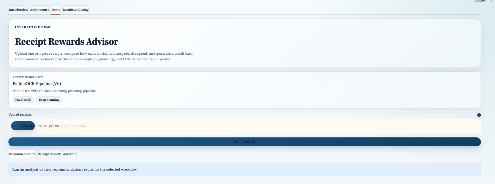
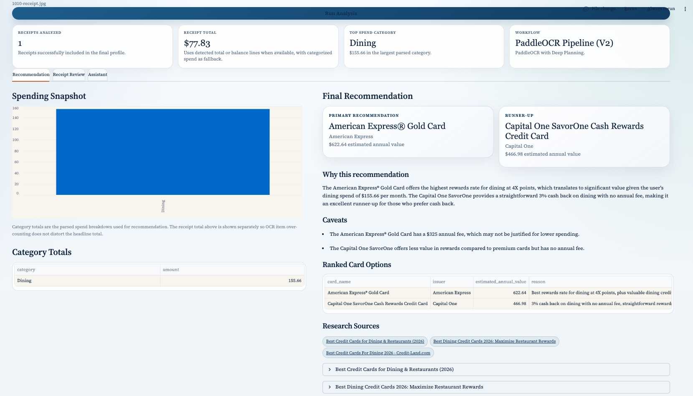

# Receipt Rewards Advisor

Receipt Rewards Advisor is a project that turns receipt images into a spending profile and then recommends a credit card using an LLM-driven control phase.

The project is organized around the agent pipeline described below:

1. Perception: read the receipt
2. Planning: convert raw text into categorized spend
3. Control: research current cards and recommend the best fit

## What Is Included

The current codebase supports these end-to-end workflows:

- `Classic Pipeline (V1)`: `tesseract` OCR + `planning v1`
- `PaddleOCR Pipeline (V2)`: `paddleocr` OCR + `planning v2`
- `Structured Reference Text`: `labels` text from local annotation JSON + `planning v2`

All three workflows share the same control phase:

- OpenAI LLM for reasoning
- web search through `tool_registry.py`
- live webpage retrieval for card verification
- best-effort fallback when web tools time out

## Dataset

The project now uses one dataset only:

- `data/receipt_dataset/ds0/img`: receipt images
- `data/receipt_dataset/ds0/ann`: matching annotation JSON files

The annotation JSON files are used in the `labels` perception mode. That mode reconstructs receipt text from the provided transcriptions and bounding boxes so you can compare downstream planning results against a cleaner reference input.

Older dataset paths and fallback logic have been removed from the repo.

## Project Structure

```text
Credit-Card-Agent/
├── app.py
├── README.md
├── receipt-rewards-technical-flowchart.html
├── requirements.txt
├── tool_registry.py
├── data/
│   └── receipt_dataset/
│       └── ds0/
│           ├── ann/
│           └── img/
├── models/
│   └── planning_v1.pkl
├── notebooks/
│   ├── evaluation.ipynb
│   ├── execution_notebook.ipynb
│   ├── perception_experiments.ipynb
│   └── planning_experiments.ipynb
└── src/
    ├── control.py
    ├── main.py
    ├── perception.py
    ├── planning.py
    ├── run_sample_receipts.py
    └── utils.py
```

## Pipeline Overview

### 1. Perception

Perception lives in [`src/perception.py`](src/perception.py).

It supports exactly three modes.

#### `tesseract`

This is the classical OCR baseline.

Steps:

1. Load the receipt image with OpenCV
2. Convert to grayscale
3. Apply Gaussian blur
4. Apply adaptive thresholding
5. Estimate skew and deskew the image
6. Run `pytesseract.image_to_string`
7. Compute average OCR confidence from `image_to_data`

Why it is useful:

- simple baseline
- easy to explain in a presentation
- gives a non-DL perception path for Version 1

#### `paddleocr`

This is the deep-learning OCR path.

Steps:

1. Load the original receipt image
2. Run PaddleOCR detection and recognition
3. Collect recognized text lines and scores
4. Join them into a receipt text block

Why it is useful:

- stronger document OCR than the classical baseline on many receipts
- fits the DL version of the project
- keeps the same downstream interface as the other methods

#### `labels`

This is the structured reference-text path.

Steps:

1. Find the matching JSON in `data/receipt_dataset/ds0/ann`
2. Read each labeled text box
3. Group entries into lines using their vertical positions
4. Sort within each line by x-coordinate
5. Reconstruct the receipt text block

Why it is useful:

- provides a cleaner reference input
- helps separate OCR errors from planning errors

### 2. Planning

Planning lives in [`src/planning.py`](src/planning.py).

It takes receipt text and outputs a `SpendingProfile` with:

- merchant name
- category totals
- reported receipt total when available
- displayed receipt total used in the UI
- parsed line items
- planner metadata

#### Planning V1

Version 1 is the classical planning pipeline.

High-level logic:

1. Clean the OCR text into lines
2. Detect the merchant from header-style text
3. Extract candidate item lines and prices
4. Detect summary lines such as tax and total
5. Use merchant lookup plus keyword heuristics to assign categories
6. Sum totals per category and keep the receipt-reported total when found

This is the simpler, non-DL planning path that pairs naturally with Tesseract.

#### Planning V2

Version 2 is the deep-learning planning pipeline.

High-level logic:

1. Clean the OCR text into lines
2. Detect the merchant
3. Use the LLM-assisted receipt parser when available to separate purchase items from summary lines
4. Let the LLM parser suggest item categories when it can
5. Fall back to the transformer-based semantic classifier, then classical merchant and keyword logic when needed
6. Extract a reported receipt total from summary lines such as `total`, `balance`, or `amount due`
7. Use summary-line logic to incorporate tax, tip, fees, and discounts
8. Build the final spending profile with line items, category totals, and receipt-total metadata

Planning V2 now blends three signals:

- LLM-based receipt understanding for structure and item-level categories
- transformer zero-shot classification for semantic categorization
- classical merchant and keyword heuristics as a fallback when model confidence is weak

This layered design matters because restaurant receipts and noisy OCR outputs often fail if the system depends on only one categorization method.

Why this matters:

- receipts are not consistently formatted
- totals often include tax and tip outside the main item list
- OCR output can be noisy even when the downstream planning logic is good

### 3. Control

Control lives in [`src/control.py`](src/control.py).

The control is directed at turning the spending profile into a card recommendation.

High-level logic:

1. Convert the parsed spending profile into an LLM prompt
2. Ask the model to research current card options
3. Let the model use tools from [`tool_registry.py`](tool_registry.py)
4. Search the web for relevant current cards
5. Fetch promising webpages for verification
6. Return structured JSON with:
   - primary recommendation
   - runner-up
   - explanation
   - caveats
   - ranked cards
   - sources

The control phase now has a graceful fallback path. If web tools time out, the app keeps the perception and planning results visible and attempts a best-effort recommendation instead of crashing the whole run.

## Streamlit UI

The main presentation UI is [`app.py`](app.py).

The app is now organized as follows:

- `Introduction`
- `Architecture`
- `Demo`
- `Results & Closing`

What the UI does:

- upload one or more receipt images
- choose one of the supported workflows
- run OCR and planning
- merge multiple receipts into one spending profile
- optionally run the shared control phase
- show an architecture page with:
  - the two agent versions
  - a technical flow diagram from `receipt-rewards-technical-flowchart.html`
  - an example stage-by-stage walkthrough of perception, planning, and control outputs
- show a demo page with:
  - recommendation summary
  - receipt total and category totals
  - receipt-by-receipt parsed text
  - parsed line items
  - grounded follow-up chat
- show a final wrap-up page with:
  - overall results
  - lessons learned
  - future steps
  - closing summary

One important UI detail is that the displayed receipt total is now separated from the categorized spend breakdown:

- the headline receipt total uses the receipt-reported total when available
- the category chart and recommendation still use categorized spend totals from planning

This makes demos easier to interpret because OCR item over-counting does not automatically distort the main total shown to the user.

Example UI views:

### Demo Input View



### Demo Output View



## Notebook

The main notebook is:

- [`notebooks/execution_notebook.ipynb`](notebooks/execution_notebook.ipynb)

Typical comparison setup:

- `tesseract + planning v1`
- `paddleocr + planning v2`
- `labels + planning v2`

This is useful for showing:

- how OCR quality changes downstream performance
- whether planning improves when cleaner text is provided
- how the final recommendation depends on the upstream pipeline

## Running The Project

### 1. Clone + Install dependencies

```bash
git clone https://github.com/aeshagandhi/Credit-Card-Agent.git

python3.12 -m venv .venv
source .venv/bin/activate
pip install -r requirements.txt
```

### 2. Run the Streamlit app

```bash
./.venv/bin/streamlit run app.py
```

### 3. Run the CLI on one receipt

```bash
python -m src.main --image data/receipt_dataset/ds0/img/1007-receipt.jpg --pipeline-version v1
python -m src.main --image data/receipt_dataset/ds0/img/1007-receipt.jpg --pipeline-version v2
python -m src.main --image data/receipt_dataset/ds0/img/1007-receipt.jpg --ocr-method labels --planning-version v2
```

### 4. Compare perception modes on one receipt

```bash
python -m src.main --image data/receipt_dataset/ds0/img/1007-receipt.jpg --compare-ocr
```

### 5. Run a few sample receipts

```bash
python -m src.run_sample_receipts --pipeline-version v1 --limit 3
python -m src.run_sample_receipts --pipeline-version v2 --limit 3
python -m src.run_sample_receipts --ocr-method labels --planning-version v2 --limit 3
```

## Environment Variables

Create a `.env` file in the project root when you want the control phase or chat assistant to use OpenAI.

Typical variables:

```env
OPENAI_API_KEY=your_key_here
OPENAI_MODEL=gpt-4o-mini
OPENAI_RECEIPT_PARSER_MODEL=gpt-4o-mini
```

## Key Design Choice

The most important design choice in this project is that the interface between phases stays stable.

No matter which perception method you choose, the next phase still receives plain receipt text.

No matter which planning method you choose, the control phase still receives the same `SpendingProfile` structure.
