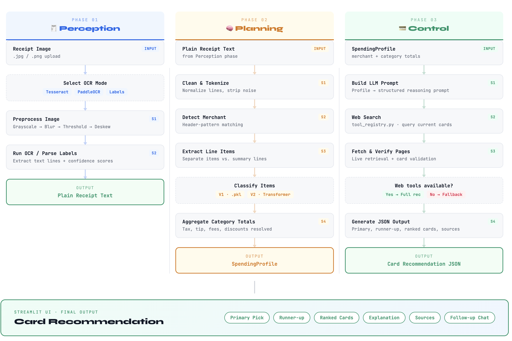

# Receipt-to-Card Recommendation Agent

Authors: Aesha Gandhi, Pranshul Bhatnagar, Gaurav Law

[Video Walkthrough](https://youtu.be/q-19Q_HRIhE)

Receipt-to-Card Recommendation Agent is a project that turns receipt images into a spending profile and then recommends a credit card using an LLM-driven control phase.

The project is organized around the agent pipeline described below:

1. Perception: read the receipt
2. Planning: convert raw text into categorized spend
3. Control: research current cards and recommend the best fit

## Project Introduction

This project tackles a practical but messy problem: people make purchases every day, but they usually do not know which credit card best matches their real spending behavior. We use receipt images as the starting point, transform them into a structured spending profile, and then use an agentic control phase to recommend a card backed by live research.

### What Problem Are We Solving?

Receipts are difficult inputs for an agent because they are visual, noisy, and inconsistent. They contain small text, summary sections, taxes, tips, totals, and merchant-specific layouts. At the same time, they capture real spending behavior much more directly than a user simply guessing their monthly habits.

### What Does Our Agent Do?

The agent reads receipt images, extracts text, builds a spending profile, and recommends a credit card. The system is organized around the three required phases from class: perception, planning, and control.

### Project Framing

- `Input`: receipt images, so the perception stage is genuinely visual rather than text-only
- `Core goal`: convert OCR output into merchant, line items, categories, receipt totals, and a spending profile
- `Output`: an actionable card recommendation with a primary recommendation, runner-up, and explanation

### Why Two Agent Versions?

The project includes both a non-DL and a DL version of the agent. This lets us compare how stronger perception and planning change the quality of the final recommendation while keeping the task and the control phase consistent.

- `Version 1`: Classical OCR + Classical Planning
- `Version 2`: PaddleOCR + Deep Planning
- `Shared Control`: the same LLM-based recommendation agent for both versions
- `Goal`: same task, fair comparison

## What Is Included

The current codebase supports these end-to-end workflows:

- `Classic Pipeline (V1)`: `tesseract` OCR + `planning v1`
- `PaddleOCR Pipeline (V2)`: `paddleocr` OCR + `planning v2`
- `Structured Reference Text`: `labels` text from local annotation JSON + `planning v2`

All three workflows share the same control phase:

- OpenAI LLM for reasoning
- web search through `tool_registry.py`
- live webpage retrieval for card verification
- best-effort fallback when web tools time out

## Dataset

The project uses the below [dataset](https://humansintheloop.org/resources/datasets/free-receipt-ocr-dataset/?utm_term=&utm_campaign=Humans+in+the+Loop+Brand+Campaign&utm_source=adwords&utm_medium=ppc&hsa_acc=7694807070&hsa_cam=17031828146&hsa_grp=139977411321&hsa_ad=596553673906&hsa_src=g&hsa_tgt=dsa-19959388920&hsa_kw=&hsa_mt=&hsa_net=adwords&hsa_ver=3&gad_source=1&gad_campaignid=17031828146&gbraid=0AAAAAByRDADeHIeG85FkAt49gtD5H2tir&gclid=CjwKCAjwnZfPBhAGEiwAzg-VzHB5E0Vi_uDwoXsTOKvU-H9uSUKHM6Daiwiqc7HojUZteDPuOGujxRoCPm0QAvD_BwE) from Humans In The Loop's Free Receipt OCR:

- `data/receipt_dataset/ds0/img`: receipt images
- `data/receipt_dataset/ds0/ann`: matching annotation JSON files

The annotation JSON files are used in the `labels` perception mode. That mode reconstructs receipt text from the provided transcriptions and bounding boxes so you can compare downstream planning results against a cleaner reference input.

## Project Structure

```text
Credit-Card-Agent/
├── app.py
├── README.md
├── receipt-rewards-technical-flowchart.html
├── requirements.txt
├── tool_registry.py
├── data/
│   └── receipt_dataset/
│       └── ds0/
│           ├── ann/
│           └── img/
├── models/
│   └── planning_v1.pkl
├── notebooks/
│   ├── evaluation.ipynb
│   ├── execution_notebook.ipynb
│   ├── perception_experiments.ipynb
│   └── planning_experiments.ipynb
└── src/
    ├── control.py
    ├── main.py
    ├── perception.py
    ├── planning.py
    ├── run_sample_receipts.py
    └── utils.py
```

## Pipeline Overview

### 1. Perception

Perception lives in [`src/perception.py`](src/perception.py).

It supports exactly three modes.

#### `tesseract`

This is the classical OCR baseline.

Steps:

1. Load the receipt image with OpenCV
2. Convert to grayscale
3. Apply Gaussian blur
4. Apply adaptive thresholding
5. Estimate skew and deskew the image
6. Run `pytesseract.image_to_string`
7. Compute average OCR confidence from `image_to_data`

Why it is useful:

- simple baseline
- easy to explain in a presentation
- gives a non-DL perception path for Version 1

#### `paddleocr`

This is the deep-learning OCR path.

Steps:

1. Load the original receipt image
2. Run PaddleOCR detection and recognition
3. Collect recognized text lines and scores
4. Join them into a receipt text block

Why it is useful:

- stronger document OCR than the classical baseline on many receipts
- fits the DL version of the project
- keeps the same downstream interface as the other methods

#### `labels`

This is the structured reference-text path.

Steps:

1. Find the matching JSON in `data/receipt_dataset/ds0/ann`
2. Read each labeled text box
3. Group entries into lines using their vertical positions
4. Sort within each line by x-coordinate
5. Reconstruct the receipt text block

Why it is useful:

- provides a cleaner reference input
- helps separate OCR errors from planning errors

### 2. Planning

Planning lives in [`src/planning.py`](src/planning.py).

It takes receipt text and outputs a `SpendingProfile` with:

- merchant name
- category totals
- reported receipt total when available
- displayed receipt total used in the UI
- parsed line items
- planner metadata

#### Planning V1

Version 1 is the classical planning pipeline.

High-level logic:

1. Clean the OCR text into lines
2. Detect the merchant from header-style text
3. Extract candidate item lines and prices
4. Detect summary lines such as tax and total
5. Use merchant lookup plus keyword heuristics to assign categories
6. Sum totals per category and keep the receipt-reported total when found

This is the simpler, non-DL planning path that pairs naturally with Tesseract.

#### Planning V2

Version 2 is the deep-learning planning pipeline.

High-level logic:

1. Clean the OCR text into lines
2. Detect the merchant
3. Use the LLM-assisted receipt parser when available to separate purchase items from summary lines
4. Let the LLM parser suggest item categories when it can
5. Fall back to the transformer-based semantic classifier, then classical merchant and keyword logic when needed
6. Extract a reported receipt total from summary lines such as `total`, `balance`, or `amount due`
7. Use summary-line logic to incorporate tax, tip, fees, and discounts
8. Build the final spending profile with line items, category totals, and receipt-total metadata

Planning V2 blends three signals:

- LLM-based receipt understanding for structure and item-level categories
- transformer zero-shot classification for semantic categorization
- classical merchant and keyword heuristics as a fallback when model confidence is weak

This layered design matters because restaurant receipts and noisy OCR outputs often fail if the system depends on only one categorization method.

Why this matters:

- receipts are not consistently formatted
- totals often include tax and tip outside the main item list
- OCR output can be noisy even when the downstream planning logic is good

### 3. Control

Control lives in [`src/control.py`](src/control.py).

The control is directed at turning the spending profile into a card recommendation.

High-level logic:

1. Convert the parsed spending profile into an LLM prompt
2. Ask the model to research current card options
3. Let the model use tools from [`tool_registry.py`](tool_registry.py)
4. Search the web for relevant current cards
5. Fetch promising webpages for verification
6. Return structured JSON with:
   - primary recommendation
   - runner-up
   - explanation
   - caveats
   - ranked cards
   - sources

The control phase has a graceful fallback path. If web tools time out, the app keeps the perception and planning results visible and attempts a best-effort recommendation instead of crashing the whole run.

## Architecture Walkthrough

The system is built as a three-stage agent pipeline:

- `Perception`: convert receipt images into text
- `Planning`: transform receipt text into merchant, line items, totals, and a spending profile
- `Control`: recommend a credit card using an LLM plus live web research

The two required agent versions differ in perception and planning, while sharing the same control phase for a fair comparison.

### Two Required Agent Versions

#### Version 1: Non-DL Agent

- `Perception`: Tesseract OCR with classical image preprocessing such as grayscale conversion, thresholding, and deskewing
- `Why it is non-DL`: Tesseract represents the non-deep-learning approach because it relies on a traditional OCR pipeline and pattern-based character recognition rather than modern deep neural text detectors and recognizers
- `Planning`: classical parsing and non-DL categorization logic that converts OCR text into spending totals

#### Version 2: DL Agent

- `Perception`: PaddleOCR for stronger receipt text extraction
- `Why it is DL`: PaddleOCR represents the deep-learning approach because it uses learned models to detect text regions and recognize the text content, which makes it more robust on noisy, irregular receipt layouts
- `Planning`: deep planning with transformer-based semantic classification plus LLM-assisted receipt understanding

#### Shared Control Phase

Both versions use the same control phase: an OpenAI model with web search and webpage tools. This keeps the comparison fair and makes it easier to isolate how perception and planning quality affect the final recommendation.

- live card research
- LLM reasoning
- structured JSON recommendation output
- shared across both agents

### Evaluation Support

`Structured Reference Text` uses the dataset annotation JSON to reconstruct receipt text. It is helpful for demos and evaluation because it approximates a cleaner upper bound for the rest of the pipeline and helps show whether downstream errors come from OCR quality or later planning logic.

### Why This Design

- `Image-based input`: the project starts from receipt images rather than text, so the perception phase is genuinely visual and satisfies the course requirement
- `Two comparable agents`: the non-DL and DL versions share the same task and control phase, making comparison more meaningful
- `Stable interface`: every perception method outputs receipt text, and every planning method outputs the same `SpendingProfile` structure, so the rest of the pipeline stays reusable

### Example Stage-by-Stage Walkthrough

The UI includes an illustrative example showing the kind of data each stage produces. The exact text, totals, and recommendation vary by receipt and workflow, but the structure is stable.

#### Step 1: Input Receipt

```text
Receipt image: grocery purchase
WHOLE FOODS MARKET
Organic Apples      5.49
Salmon Fillet      14.99
Sparkling Water     4.29
Tax                 2.04
Total              26.81
```

#### Step 2: Perception Output

```text
Classical OCR (V1):
WHOLE F00DS MARKET
Organic Apples 5.49
Salmon Fillet 14.99
Sparkling Water 4.29
Tax 2.04
Total 26.81

DL OCR (V2):
WHOLE FOODS MARKET
Organic Apples 5.49
Salmon Fillet 14.99
Sparkling Water 4.29
Tax 2.04
Total 26.81
```

#### Step 3: Planning Output

```text
spending_profile = {
  merchant: "Whole Foods Market",
  reported_total: 26.81,
  category_totals: {
    groceries: 24.77,
    other: 2.04
  },
  top_category: "groceries",
  parsed_line_items: 4
}
```

#### Step 4: Control Output

```text
LLM recommendation:
Primary card: Amex Gold
Runner-up: Blue Cash Preferred

Reasoning:
- groceries dominate the spend
- supermarket rewards are the best fit
- card comparison is backed by live web research
```

### Technical Flow Diagram

Below is a visual flow diagram that gives a visual overview of how receipt inputs move through perception, planning, and control.

## Streamlit UI

The main presentation UI is [`app.py`](app.py).

The app is organized as follows:

- `Introduction`
- `Architecture`
- `Demo`
- `Results & Closing`

The `Introduction` tab presents the problem framing, team members, and why the project compares two agent versions. The `Architecture` tab explains the perception, planning, and control design, compares the non-DL and DL agents, shows the reference-text evaluation path, includes an example walkthrough, and embeds the technical flow diagram. The `Results & Closing` tab summarizes outcomes, lessons learned, future steps, and the final takeaway.

What the UI does:

- upload one or more receipt images
- choose one of the supported workflows
- run OCR and planning
- merge multiple receipts into one spending profile
- optionally run the shared control phase
- show an architecture page with:
  - the two agent versions
  - a technical flow diagram from `receipt-rewards-technical-flowchart.html`
  - an example stage-by-stage walkthrough of perception, planning, and control outputs
- show a demo page with:
  - recommendation summary
  - receipt total and category totals
  - receipt-by-receipt parsed text
  - parsed line items
  - grounded follow-up chat
- show a final wrap-up page with:
  - overall results
  - lessons learned
  - future steps
  - closing summary

One important UI detail is that the displayed receipt total is separated from the categorized spend breakdown:

- the headline receipt total uses the receipt-reported total when available
- the category chart and recommendation still use categorized spend totals from planning

This makes demos easier to interpret because OCR item over-counting does not automatically distort the main total shown to the user.

Example UI views:

### Demo Input View


### Demo Output View


## Notebook

The main notebook is:

- [`notebooks/execution_notebook.ipynb`](notebooks/execution_notebook.ipynb)

Typical comparison setup:

- `tesseract + planning v1`
- `paddleocr + planning v2`
- `labels + planning v2`

This is useful for showing:

- how OCR quality changes downstream performance
- whether planning improves when cleaner text is provided
- how the final recommendation depends on the upstream pipeline

## Results, Lessons, and Closing

### Overall Results

- `The non-DL agent was a useful baseline`: the classical pipeline was interpretable and worked reasonably well on cleaner receipts, but it was more brittle when merchant names or line-item wording varied
- `The DL agent was more robust`: PaddleOCR plus deep planning handled noisy layouts and restaurant-style receipts more reliably, especially when receipt structure was irregular or OCR text was incomplete
- `Perception quality drove downstream quality`: the structured reference-text workflow showed that when the text input is cleaner, planning and recommendation quality improve noticeably, so OCR remained the main bottleneck in the full pipeline

### Lessons Learned

#### What Was Hard

- OCR errors compound and can distort category totals, spend profiles, and final recommendations
- receipt structure matters, because the agent must separate line items from summary lines before categorization
- totals, taxes, tips, discounts, and payment lines often look similar to real purchased items

#### What Helped

- keeping the interfaces between perception, planning, and control stable made the system easier to debug, compare, and present
- using the same LLM-based control phase for both agents made it easier to isolate the effect of perception and planning choices
- showing receipt image, OCR text, spending profile, and recommendation in one UI made failures easier to diagnose and explain

### Future Steps

- improve receipt understanding so tax, tip, discounts, and totals are handled more consistently across merchants
- expand evaluation with more receipts, more merchant types, and clearer quantitative metrics for OCR quality, category accuracy, and recommendation usefulness
- broaden card research with a richer set of current cards, benefits, and issuer rules to make the control phase more comprehensive

### Closing

This project uses an image-based agent that includes perception, planning, and control, and it compares a non-DL and DL version on the same task.

- visual receipt input
- two agent versions
- shared LLM control phase
- evaluation-oriented design
- transparent end-to-end UI

## Running The Project

### 1. Clone + Install dependencies

```bash
git clone https://github.com/aeshagandhi/Credit-Card-Agent.git

python3.12 -m venv .venv
source .venv/bin/activate
pip install -r requirements.txt
```

### 2. Run the Streamlit app

```bash
./.venv/bin/streamlit run app.py
```

### 3. Run the CLI on one receipt

```bash
python -m src.main --image data/receipt_dataset/ds0/img/1007-receipt.jpg --pipeline-version v1
python -m src.main --image data/receipt_dataset/ds0/img/1007-receipt.jpg --pipeline-version v2
python -m src.main --image data/receipt_dataset/ds0/img/1007-receipt.jpg --ocr-method labels --planning-version v2
```

### 4. Compare perception modes on one receipt

```bash
python -m src.main --image data/receipt_dataset/ds0/img/1007-receipt.jpg --compare-ocr
```

### 5. Run a few sample receipts

```bash
python -m src.run_sample_receipts --pipeline-version v1 --limit 3
python -m src.run_sample_receipts --pipeline-version v2 --limit 3
python -m src.run_sample_receipts --ocr-method labels --planning-version v2 --limit 3
```

## Environment Variables

Create a `.env` file in the project root when you want the control phase or chat assistant to use OpenAI.

Typical variables:

```env
OPENAI_API_KEY=your_key_here
OPENAI_MODEL=gpt-4o-mini
OPENAI_RECEIPT_PARSER_MODEL=gpt-4o-mini
```

## Key Design Choice

The most important design choice in this project is that the interface between phases stays stable.

No matter which perception method you choose, the next phase still receives plain receipt text.

No matter which planning method you choose, the control phase still receives the same `SpendingProfile` structure.
